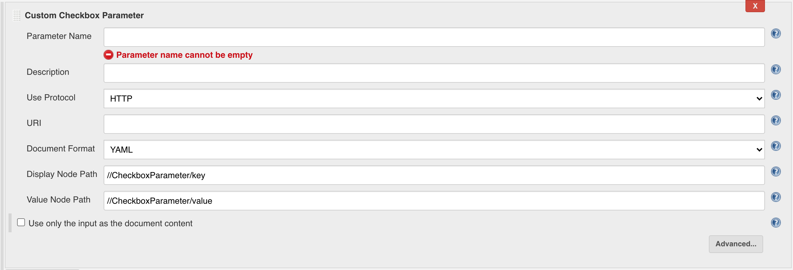
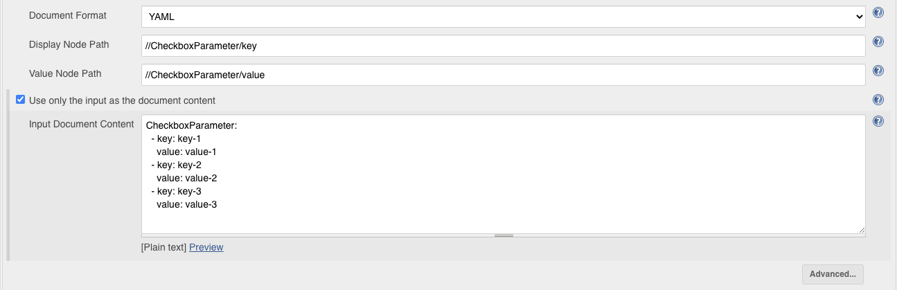
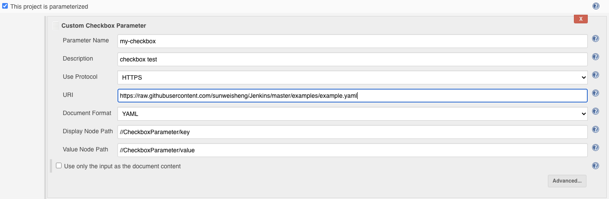
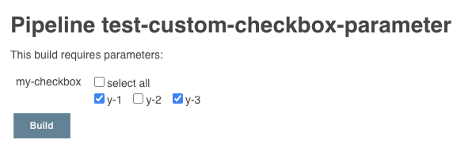
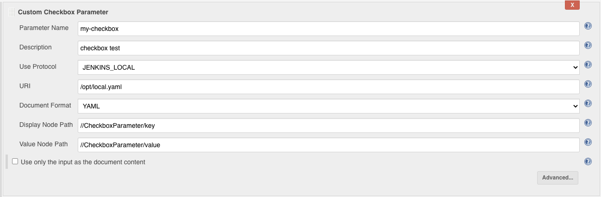
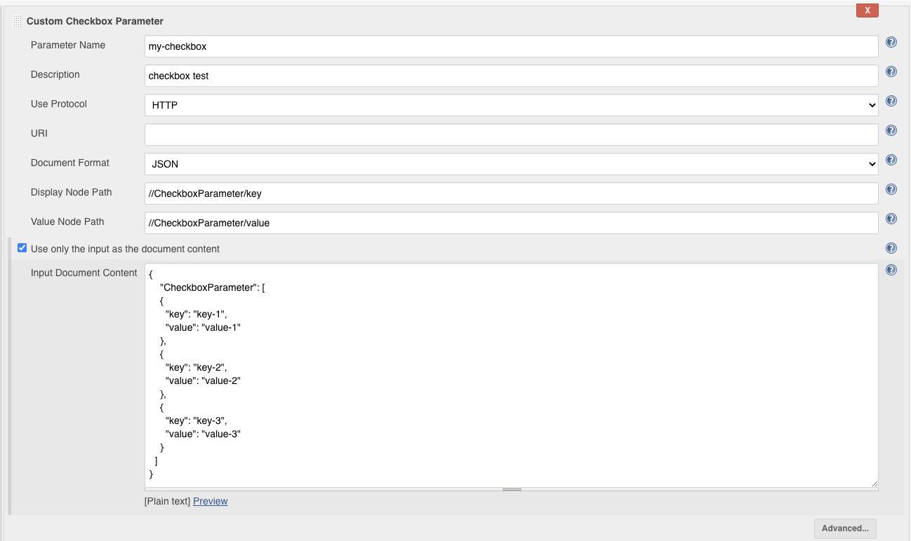

# Custom Checkbox Parameter Plugin

This plug-in can dynamically create a set of check boxes for users to check before building. The check box settings are configured through YAML or JSON files, and the file content can be obtained through HTTP, HTTPS, or file paths.
After checking the check box, the user can use params['ParameterName'] in the build script to get the selected value. The result of the user's selection is returned in the form of a string separated by "," value1, value2, value3.

[中文说明](README_zh.md)

## Setting instructions

The complete configuration content example is as follows, but it is not necessary to fill in all the content. Most configuration content can use the default values:


Parameter Name: Use params['ParameterName'] in the build script to get the value selected by the user.

Description: The description text of the construction parameters.

Use Protocol: HTTP_HTTPS, FILE_PATH, FILE_PATH represents the file system path, HTTP_HTTPS refers to HTTP or HTTPS protocol.

URI: If the "Use Protocol" option is HTTP_HTTPS, enter the URL of the file for the URI, if the "Use Protocol" option is FILE_PATH, then enter the file path for the URI.

Document Format: supports YAML and JSON formats. (YAML requires spaces to be aligned and spaces after ":")

Examples of YAML format and JSON format are as follows:

```yaml
CheckboxParameter:
  - key: key-1
    value: value-1
    checked: true
  - key: key-2
    value: value-2
    checked: false
  - key: key-3
    value: value-3
    checked: true
```

```json
{
    "CheckboxParameter": [
    {
      "key": "key-1",
      "value": "value-1",
      "checked": true
    },
    {
      "key": "key-2",
      "value": "value-2",
      "checked": false
    },
    {
      "key": "key-3",
      "value": "value-3",
      "checked": true
    }
  ]
}
```

Display Node Path: Specify the node path for the check box to display the content (this format is common to different formats). The root of the node in the file is represented by "//", and the child nodes are separated by "/". The default is: / /CheckboxParameter/key, corresponding to the content selected in the above example: key-1, key-2, key-3, the node path can be customized according to this mode.

Value Node Path: Specify the node path for the check box to select the value (this format is common to different formats). The root of the node in the file is represented by "//", and the child nodes are separated by "/". The default is: / /CheckboxParameter/value, corresponding to the content selected in the above example: value-1, value-2, value-3, the node path can be customized according to this mode.

Checked Node Path: Specify the node path for the initial checked state. The default is `//CheckboxParameter/checked`. When `checked` is present, every checkbox entry must define it as `true` or `false`. Existing configuration files without this node remain supported and start with no checkbox selected.

For a parameter saved in the job configuration, the configured `checked` values are used before the first selection. After a user submits the build form, the previous selection takes precedence, including the case where the user clears every checkbox.

## Other settings

After selecting the "Use only the input as the document content" check box, you can directly enter the YAML format or JSON format content of the configuration check box. The content format is set by the "Document Format" option, and the URI will be ignored after directly entering the configuration content Settings.



## Read remote HTTPS configuration checkbox example

[Configuration file address](https://raw.githubusercontent.com/sunweisheng/Jenkins/master/examples/example.yaml)

Configuration file content:

```yaml
CheckboxParameter:
  - key: y-1
    value: value-1
    checked: true
  - key: y-2
    value: value-2
    checked: false
  - key: y-3
    value: value-3
    checked: true
```



Build script:

```groovy
node{
    print params['my-checkbox']
}
```

Construction parameter selection:



```text
Started by user sunweisheng
Running in Durability level: MAX_SURVIVABILITY
[Pipeline] Start of Pipeline
[Pipeline] node
Running on Jenkins in /root/.jenkins/workspace/test-custom-checkbox-parameter
[Pipeline] {
[Pipeline] echo
value-1,value-3
[Pipeline] }
[Pipeline] // node
[Pipeline] End of Pipeline
Finished: SUCCESS
```

In addition: the results of the check boxes selected during each build will be saved for the user to use next time.

## Other configuration examples

Use file system path:



Enter the file content directly (Json format):



## Declarative Pipeline


Configuration file content:

```groovy
pipeline {
    agent any
    parameters {
        checkboxParameter(name: 'Platforms1', format: 'JSON',
                pipelineSubmitContent: '{"CheckboxParameter": [{"key": "nt","value": "nt","checked": true},{"key": "linux","value": "linux","checked": false},{"key": "unix","value": "unix","checked": true}]}', description: '')
        checkboxParameter(name: 'Platforms2', format: 'YAML',
                pipelineSubmitContent: "CheckboxParameter: \n  - key: monday\n    value: monday\n    checked: true\n  - key: tuesday\n    value: tuesday\n    checked: false\n", description: '')
    }
    stages {
        stage('Hello') {
            steps {
                echo 'Hello World'
            }
        }
    }
}
```

Show checkbox during build:


parameter list:

- name: required
- description: not required, default ""
- format: required, YAML, JSON, default Empty
- displayNodePath: not required, default //CheckboxParameter/key
- valueNodePath: not required, default //CheckboxParameter/value 
- checkedNodePath: not required, default //CheckboxParameter/checked
- pipelineSubmitContent: required

You can create parameters in the build script, but because each execution of the build script creates a new "Custom Checkbox Parameter" build parameter, the last selected value cannot be retained.

## Jenkins Job Builder

Jenkins Job Builder YAML describes the Jenkins job itself. It is different from the YAML document consumed by this plugin. Jenkins Job Builder does not currently provide a `custom-checkbox` parameter type, so adding a `CheckboxParameter:` section beside `parameters:` is not supported and `jenkins-jobs update` will reject it.

Use Jenkins UI configuration or Declarative Pipeline instead. In Pipeline, pass the checkbox document through `pipelineSubmitContent`:

```groovy
parameters {
    checkboxParameter(name: 'Platforms', format: 'YAML',
            pipelineSubmitContent: '''CheckboxParameter:
  - key: linux
    value: linux
    checked: true
  - key: windows
    value: windows
    checked: false
''', description: '')
}
```
