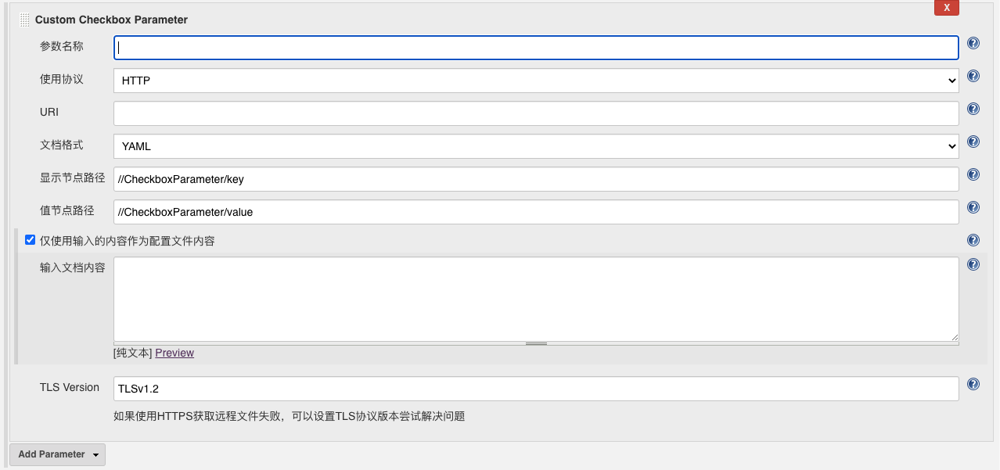
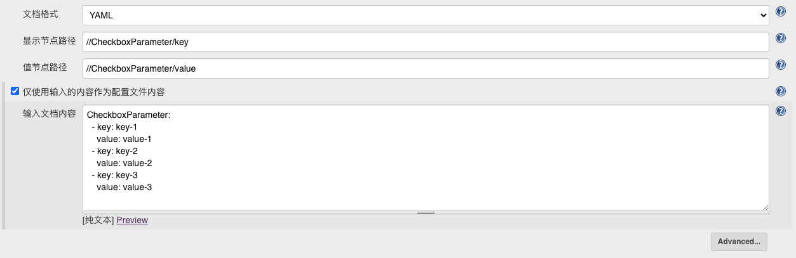
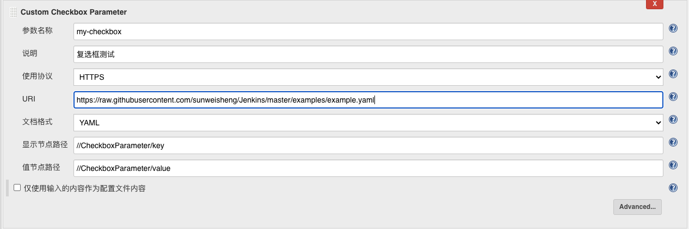
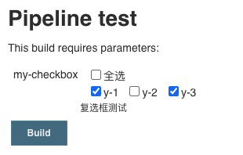
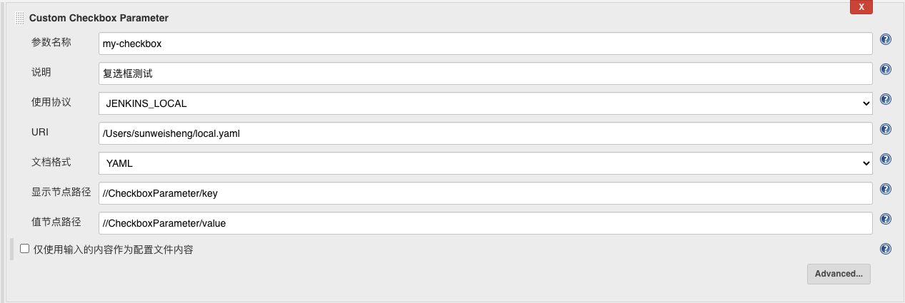
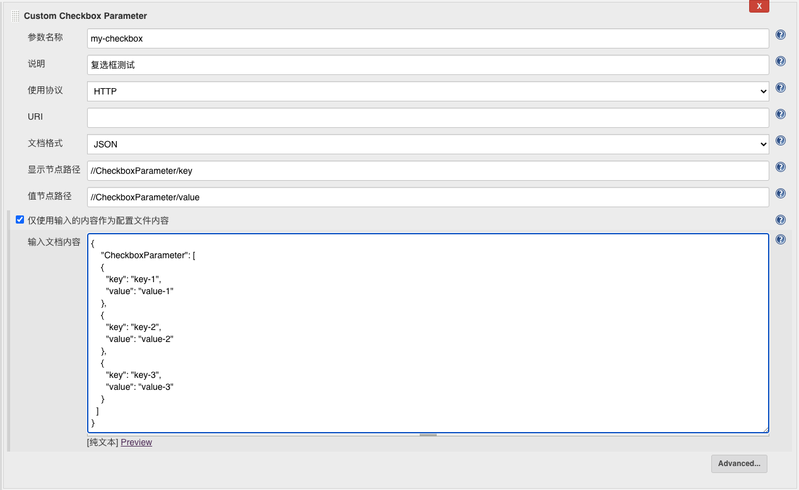
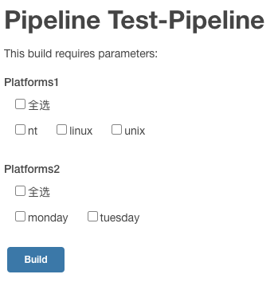

# Custom Checkbox Parameter Plugin

这个插件可以在构建之前动态的创造一组复选框供用户进行勾选，复选框的设置通过YAML或JSON文件进行配置，文件内容可以通过HTTP、HTTPS或文件路径获取。
用户勾选复选框之后可以在构建脚本中使用params['参数名称']来获取选择的值，用户选择的结果通过value1,value2,value3这种用“,”分割的字符串形式返回。

## 设置说明

完整配置内容示例如下，但没有必要填写所有内容，大多数配置内容可以使用默认值：


参数名称：在构建脚本中使用params['参数名称']获取用户选择的值。

说明：构建参数的说明文字。

使用协议：HTTP_HTTPS、FILE_PATH，FILE_PATH代表文件系统路径，HTTP_HTTPS是指HTTP或HTTPS协议。

URI：如果“使用协议”选项是HTTP_HTTPS则URI请输入文件的URL，如果“使用协议”选项是FILE_PATH则URI请输入文件路径。

文档格式：支持YAML和JSON两种格式。（YAML要求空格对齐并且“:”后要有空格）

YAML格式和JSON格式示例如下:

```yaml
CheckboxParameter:
  - key: key-1
    value: value-1
  - key: key-2
    value: value-2
  - key: key-3
    value: value-3
```

```json
{
    "CheckboxParameter": [
    {
      "key": "key-1",
      "value": "value-1"
    },
    {
      "key": "key-2",
      "value": "value-2"
    },
    {
      "key": "key-3",
      "value": "value-3"
    }
  ]
}
```

显示节点路径：指定用于复选框显示内容的节点路径（不同格式通用此路径格式），文件中节点的根用"//"表示，子节点之间用"/"分割，默认是：//CheckboxParameter/key，对应上面的示例选取的内容是：key-1、key-2、key-3，可根据此模式自定义节点路径。

值节点路径：指定用于复选框选择值的节点路径（不同格式通用此路径格式），文件中节点的根用"//"表示，子节点之间用"/"分割，默认是：//CheckboxParameter/value，对应上面的示例选取的内容是：value-1、value-2、value-3，可根据此模式自定义节点路径。

## 其他设置说明

选择“仅使用输入的内容作为配置文件内容”复选框之后，可以直接输入配置复选框的YAML格式或JSON格式内容，内容格式由"文档格式"选项设置，直接输入配置内容后将忽略URI设置。



## 读取远程HTTPS配置复选框示例

[配置文件地址](https://raw.githubusercontent.com/sunweisheng/Jenkins/master/examples/example.yaml)

配置文件内容：

```yaml
CheckboxParameter:
  - key: y-1
    value: value-1
  - key: y-2
    value: value-2
  - key: y-3
    value: value-3
```



构建脚本：

```groovy
node{
    print params['my-checkbox']
}
```

构建参数选择：



构建结果：

```txt
Running in Durability level: MAX_SURVIVABILITY
[Pipeline] Start of Pipeline
[Pipeline] node
Running on Jenkins in /Users/sunweisheng/Documents/HomeCode/custom-checkbox-parameter-plugin/work/workspace/test
[Pipeline] {
[Pipeline] echo
value-1,value-3
[Pipeline] }
[Pipeline] // node
[Pipeline] End of Pipeline
Finished: SUCCESS
```

另外：每次构建时选择的复选框结果会保存下来，方便用户下次构建时使用。

## 其他配置示例

使用文件系统路径：



直接输入文件内容（Json格式）：



## Declarative Pipeline

配置文件内容：

```groovy
pipeline {
    agent any
    parameters {
        checkboxParameter(name: 'Platforms1', format: 'JSON',
                pipelineSubmitContent: '{"CheckboxParameter": [{"key": "nt","value": "nt"},{"key": "linux","value": "linux"},{"key": "unix","value": "unix"}]}', description: '')
        checkboxParameter(name: 'Platforms2', format: 'YAML',
                pipelineSubmitContent: "CheckboxParameter: \n  - key: monday\n    value: monday\n  - key: tuesday\n    value: tuesday\n", description: '')
    }
    stages {
        stage('Hello') {
            steps {
                echo 'Hello World'
            }
        }
    }
}
```

构建时显示复选框：



参数列表：

- name：必填
- description：非必填，默认“”
- format：必填，YAML、JSON，默认Empty
- displayNodePath：非必填，默认//CheckboxParameter/key
- valueNodePath：非必填，默认//CheckboxParameter/value
- pipelineSubmitContent: 必填 

可以在构建脚本中创建参数，但因为每次执行构建脚本都会创建一个新的"Custom Checkbox Parameter"构建参数，所以无法保留上次选择的值。
